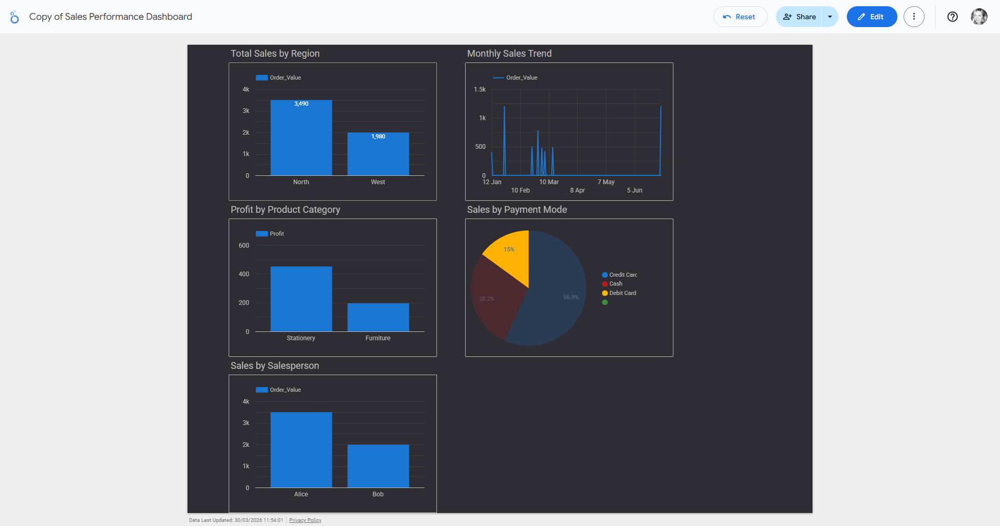

# customer-insights-dashboard-lookerstudio
Designed an interactive Looker Studio dashboard to visualize sales performance, uncover trends, and support data-driven decisions.
This project showcases an interactive sales dashboard built in Looker Studio to analyze performance across regions, product categories, and time. The goal was to translate raw sales data into clear, actionable insights.
### 🔗 Live Dashboard  
[View Interactive Dashboard](https://lookerstudio.google.com/s/vTSejjizMbE)
## 📊 Dashboard Preview  

---

## 📈 Key Features  
- Sales performance by region (North, West, etc.)  
- Monthly sales trend analysis  
- Profit by product category  
- Sales breakdown by payment method  
- Sales performance by salesperson  

---

## 🧠 Key Insights  
- North region generated the highest sales (~3.5K), outperforming other regions  
- Sales activity shows fluctuations with spikes earlier in the year  
- Stationery category leads in profit compared to furniture  
- Credit card is the dominant payment method (~57% of sales)  
- Top-performing salesperson significantly outperforms peers  

---

## 🛠 Tools Used  
- Looker Studio  
- Excel (data preparation)  

---

## 💡 Design Approach  
Focused on clarity and usability by structuring the dashboard to highlight key metrics, reduce cognitive load, and support quick decision-making.
